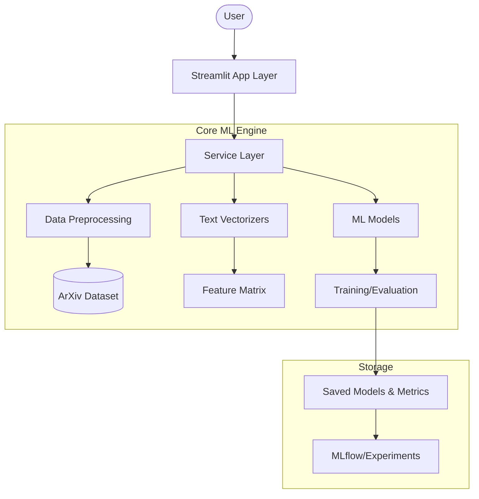

# 🧪 Scientific Abstract Classification

[](https://www.python.org/)
[](https://streamlit.io/)
[](https://scikit-learn.org/)
[](LICENSE)

**Smart topic classification for scientific abstracts using state-of-the-art machine learning.**

---

## 📖 Introduction

In the era of rapid scientific advancement, researchers are overwhelmed by thousands of new abstracts daily. **Scientific Abstract Classification** is a comprehensive tool designed to automatically categorize arXiv abstracts into their respective fields of study.

By leveraging advanced text vectorization and diverse machine learning algorithms, this project provides a robust solution for researchers, data scientists, and developers looking to organize and explore large-scale scientific literature.

## ✨ Key Features

- 🔍 **Interactive Data Exploration**: Deep dive into the arXiv dataset with built-in visualization and analysis tools.
- 🛠️ **Full ML Pipeline**: Integrated data sampling, preprocessing, and model training workflows.
- 🧠 **Advanced Vectorization**: Supports TF-IDF, LSA, Sentence Embeddings (E5), and FAISS-indexed retrieval.
- 📈 **Experiment Tracking**: Managed experimentation with support for multiple classifiers and ensembles.
- 🚀 **Live Prediction**: User-friendly Streamlit interface for real-time abstract classification.

## 🏗️ Overall Architecture

The system follows a modular architecture, separating the core ML logic from the interactive application layer.



## ⚙️ Env Configuration

The project uses a centralized YAML configuration system located at `configs/config.yaml`.

| Key | Description | Default |
|-----|-------------|---------|
| `random_state` | Seed for reproducibility | `42` |
| `data.raw_dir` | Directory for raw datasets | `data/raw` |
| `data.processed_dir` | Directory for cleaned data | `data/processed` |
| `sampling.topics` | List of categories to extract | `["cs", "math", ...]` |
| `train.test_size` | Ratio of data used for testing | `0.2` |

> [!TIP]
> You can also override configuration via environment variables if needed for CI/CD pipelines.

## 🚀 Installation

This project uses [uv](https://github.com/astral-sh/uv) for fast, reliable dependency management.

### Prerequisites

- **Python**: 3.12 or higher
- **UV**: (Highly Recommended) `curl -LsSf https://astral-sh.uv/install.sh | sh`

### Setup

1. **Clone the repository**:
   ```bash
   git clone https://github.com/ducquan19/scientific-abstract-classification.git
   cd scientific-abstract-classification
   ```

2. **Sync dependencies**:
   ```bash
   uv sync
   ```

3. **Install with Pip (Legacy)**:
   ```bash
   pip install -e .
   ```

## 🏃 Running the Project

Start the interactive Streamlit dashboard:

```bash
uv run streamlit run main.py
```

Or execute the training pipeline via CLI:

```bash
uv run python src/training/train.py --config configs/config.yaml
```

## 📂 Folder Structure

```text
.
├── app/                  # Frontend: Streamlit web application
│   ├── pages/            # Multi-page dashboard logic
│   └── services/         # App-specific business logic
├── configs/              # Global project configurations (YAML)
├── data/                 # Data directory (Raw, Interim, Processed)
├── src/                  # Core Engine
│   ├── models/           # Implementation of ML classifiers
│   ├── preprocessing/    # Cleaning and normalization logic
│   ├── vectorizers/      # Feature extraction (BoW, TF-IDF, E5)
│   └── training/         # Pipelines for model training
├── experiments/          # Logs and performance reports
└── pyproject.toml        # Dependency and build configuration
```

## 🗺️ Roadmap

- [ ] **BERT Support**: Full integration with HuggingFace Transformers.
- [ ] **REST API**: Export core models as a FastAPI microservice.
- [ ] **Cloud Deployment**: One-click deployment to HuggingFace Spaces.
- [ ] **Explainability**: Add LIME/SHAP for model transparency.

## 🤝 Contribution Guidelines

We welcome contributions! To get started:

1. **Fork** the repository.
2. Create a **Feature Branch** (`git checkout -b feature/AmazingFeature`).
3. **Commit** your changes (`git commit -m 'Add AmazingFeature'`).
4. **Push** to the branch (`git push origin feature/AmazingFeature`).
5. Open a **Pull Request**.

Refer to our [CONTRIBUTING.md](CONTRIBUTING.md) for detailed style guides.

## 📄 License

Distributed under the **MIT License**. See `LICENSE` for more information.

---
